## 产品介绍

Touch是一款基于区块链和AI技术的社交应用软件，允许用户以安全透明的方式与个性相符的人进行交友匹配。Touch能够促进链上数据隐私的保护，同时也能为大规模算法数据在链上应用带来革命性影响。

## 团队成员

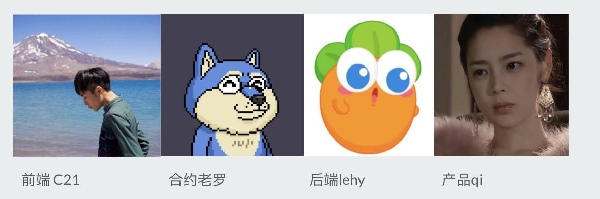

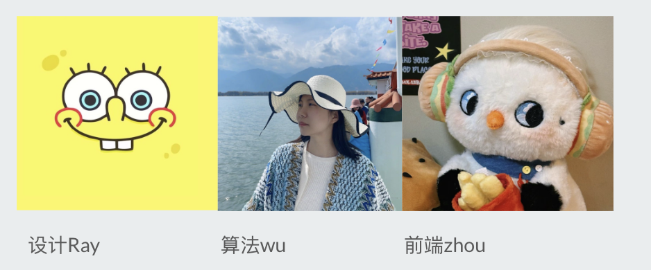

项目网址：https://touch-heart.pro/

代码地址：https://github.com/orgs/Touch-n-Heart/repositories

产品名称：

- 英文：Touch  
- 中文：触动之心

logo: 

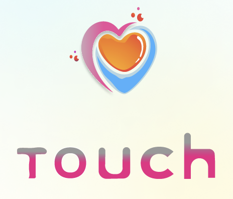

## 产品目标

帮助全世界年轻人找到自己的知心人

## 产品特点

五大特点

- web3移动app： 做移动端最领先的AIGC + WEB3社交应用, 解决年轻人在线社交中的信任、隐私和透明性等问题

- AI算法匹配： 产品以人为核心，让用户匹配到志趣相同的人，并用链上问卷人格（INTJ）测试，帮助用户更快，更准确找到社交目标，增强用户的可信度

- 共识与激励： 独创性将NFT与用户的个人信用和兴趣爱好标签绑定，通过共识投票的方法解决社交过程中的信任问题，让贡献隐私数据的人获得更高的权限和奖励

- 去中心化交流：为用户提供去中心化安全可靠的对话消息功能，同时保护用户的隐私数据

- 打通虚拟与现实边界：社交约会的人一起或者邀请他人拆NFT社交盲盒，参与活动并依靠链上社交关系生产独特的AIGC的NFT，我们会线下设计手办将盲盒给参与社交活动的人

## 产品细节

4大模块，3大核心

- 用户注册

    
 
        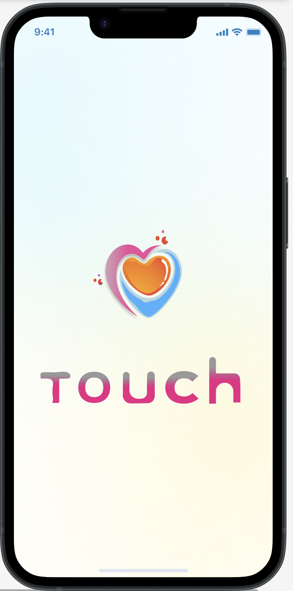
    

     
 
        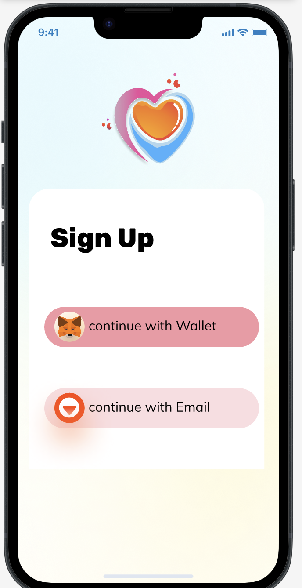
    

     
 
        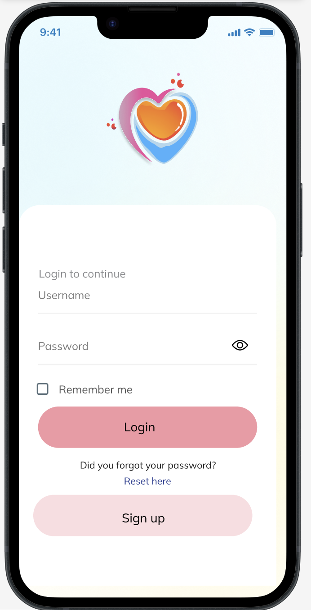
    

     
 
        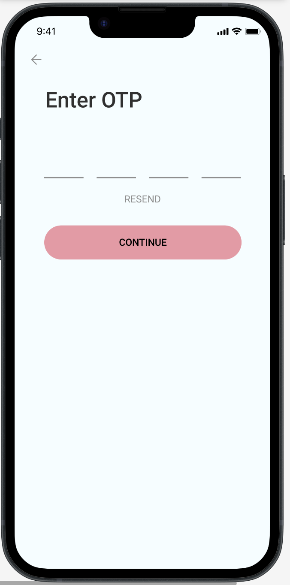
    

     
 
        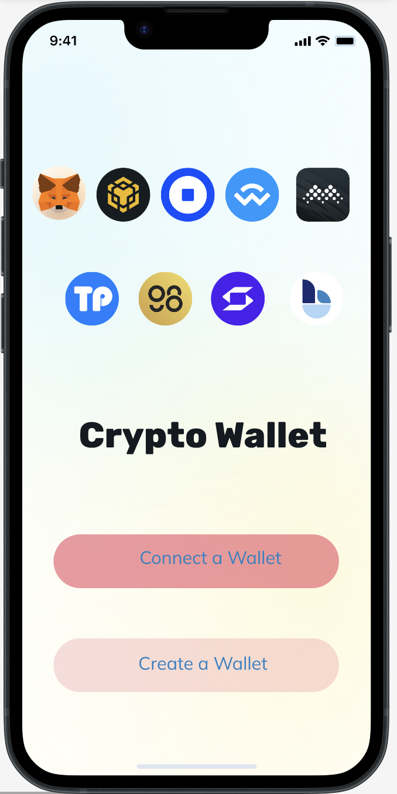
    

     
 
        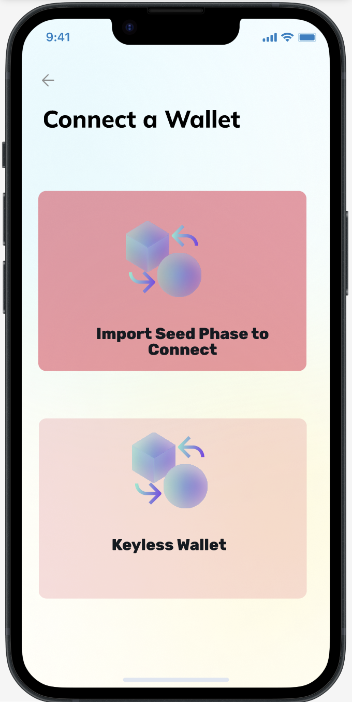
    

- 领取空投

    
 
        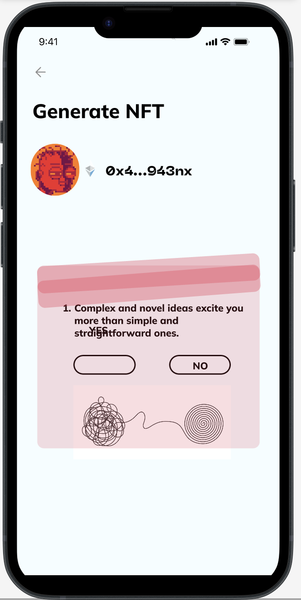
    

     
 
       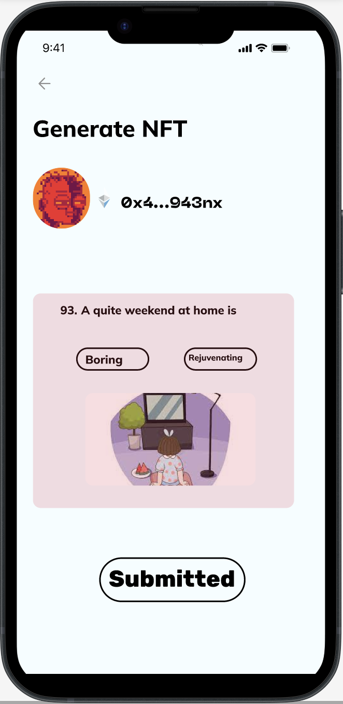
    

     
 
        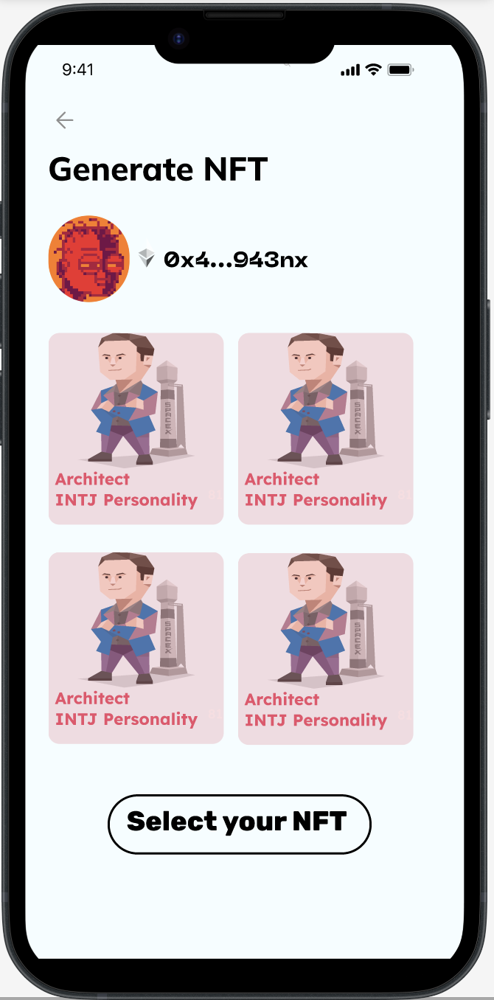
    

     
 
        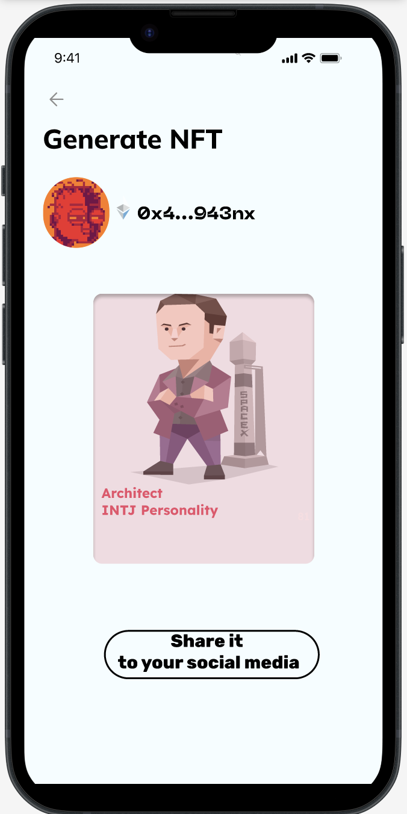
    

- 用户广场

    
 
        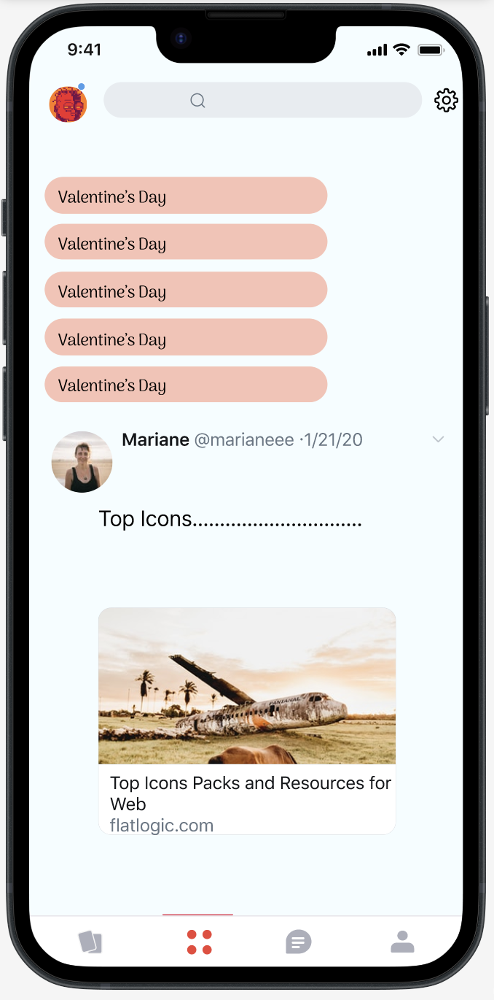
    

     
 
       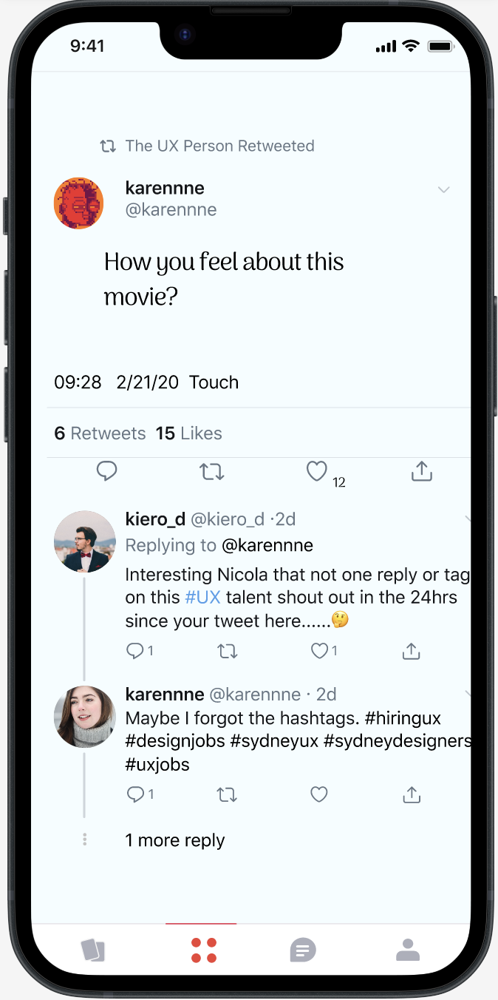
    

- 用户社交

    
 
        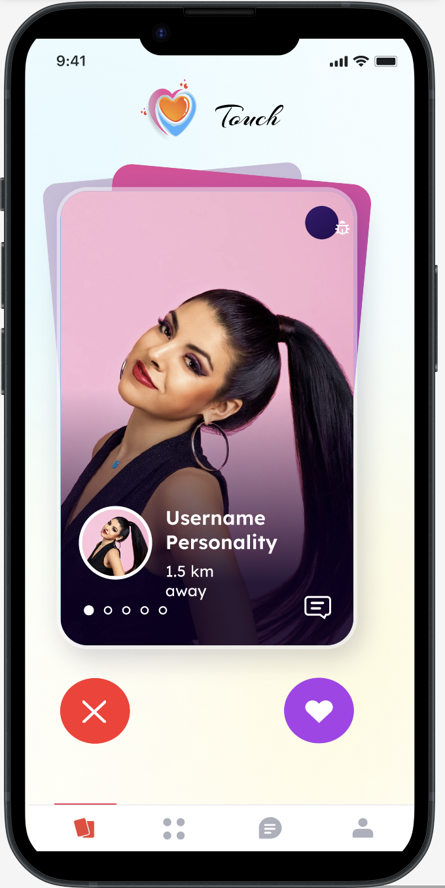
    

     
 
       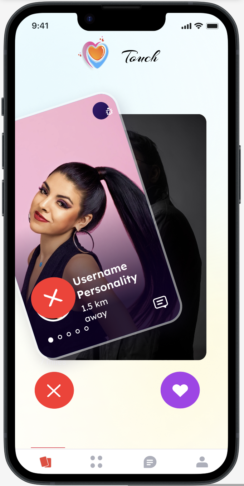
    

    
 
        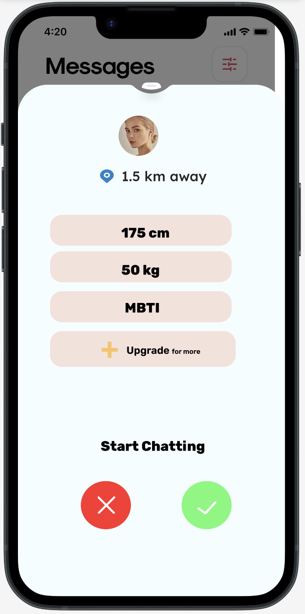
    

     
 
       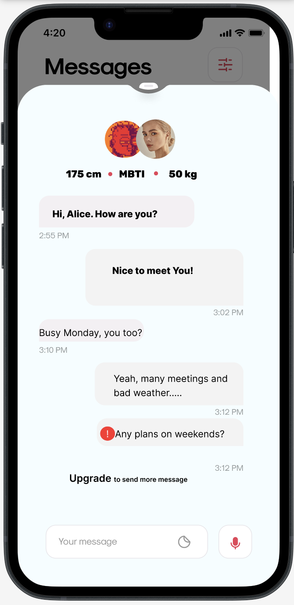
    

- 权限升级（应用商店）

    
 
       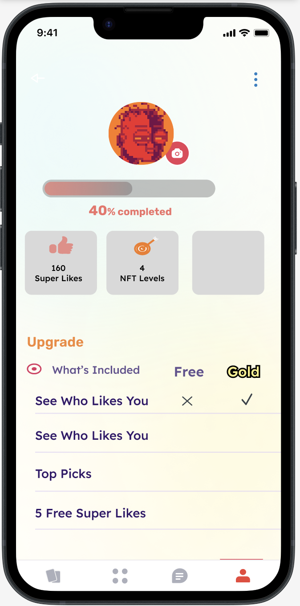
    

     
 
       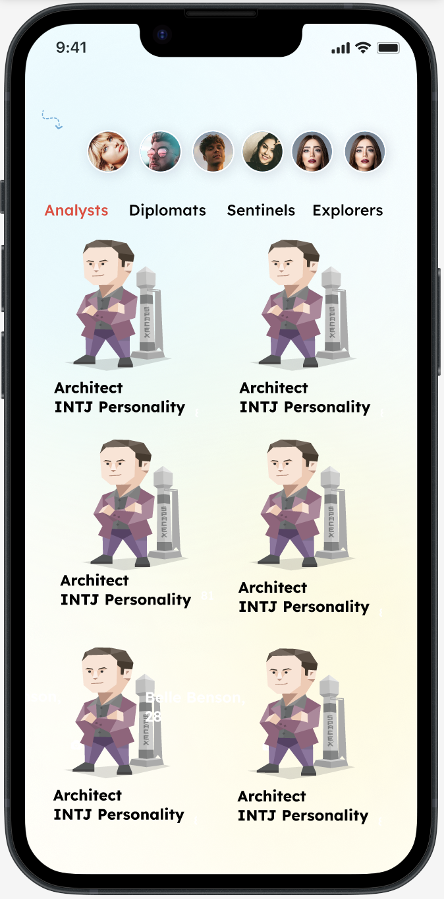
    

- 彩蛋：AI提词器

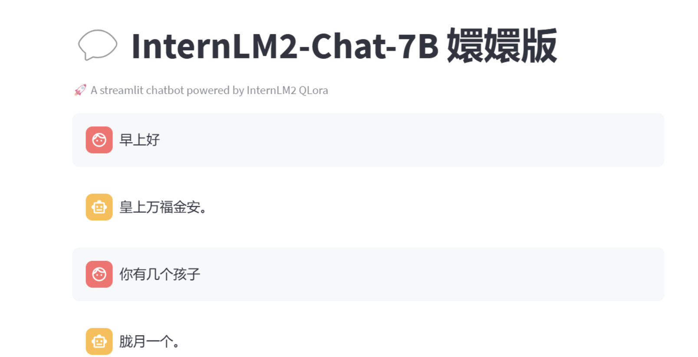

## 生态贡献

为sui链带来四大生态贡献：

- 引入Sui链和智能合约技术，吸引大量用户并激励他们通过交互和聊天获取NFT奖励。

- 解决AI算法链上隐私问题，采用IPFS进行大规模数据存储，保障用户数据安全，并为Sui链的ToB公司提供参与机会，例如与科比进行模拟对话，提供篮球相关知识，甚至比如游戏集成

- 实现线上线下结合的Sui生态位，方便用户在虚拟和实体世界之间进行交互和体验。

- 通过保护热门话题数据隐私，推动链上数据隐私的发展，为用户提供更安全的数据交互环境。

## 版权声明

我们欢迎任何有想法或有热情的人加入我的团队，请给我留言 tg: [@hungyann  ](https://t.me/@hungyann)

